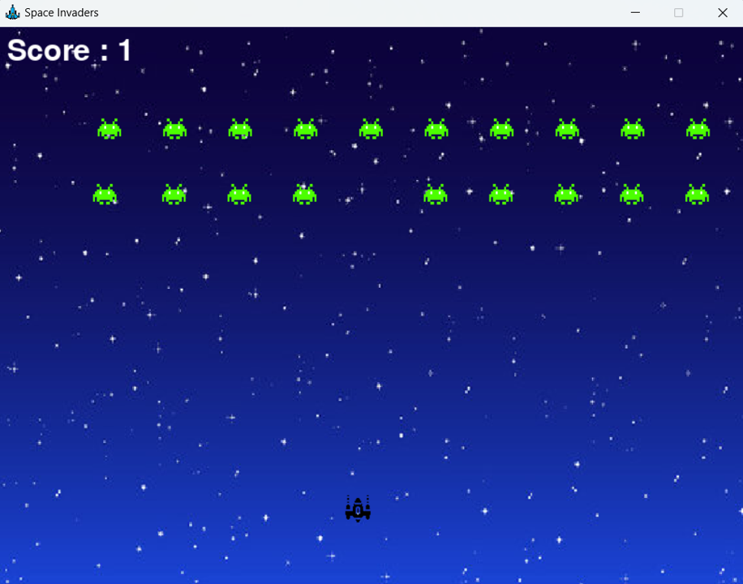

# Space Invaders Game

My first time coding a game. This is a simple implementation of the classic Space Invaders game using Python and Pygame.

## Table of Contents

- [Gameplay](#gameplay)
- [Installation](#installation)
- [How to Play](#how-to-play)
- [Screenshots](#screenshots)
- [Features](#features)
- [Contributing](#contributing)
- [License](#license)

## Gameplay

The player controls a spaceship that can move left and right at the bottom of the screen. Like the classic game, the goal is to shoot and destroy all the enemies before they reach the bottom. If an enemy reaches the bottom, the game is over. If all enemies are destroyed, the player wins.

## Installation

1. **Clone the repository:**
    ```sh
    git clone https://github.com/suni639/space-invaders.git
    cd space-invaders
    ```

2. **Install the required dependencies:**
    Ensure you have Python and Pygame installed. You can install Pygame using pip:
    ```sh
    pip install pygame
    ```

3. **Run the game:**
    ```sh
    python main.py
    ```

## How to Play

- Use the **left arrow key** (`←`) to move the spaceship left.
- Use the **right arrow key** (`→`) to move the spaceship right.
- Press the **spacebar** (`spacebar`) to shoot bullets.
- Press **R** to restart the game after a game over or when you win.

## Screenshots



## Features

- Classic Space Invaders gameplay
- Simple and intuitive controls
- Restart the game after a game over or win
- Score tracking

## License

This project is licensed under the MIT License - see the [LICENSE](LICENSE) file for details.
